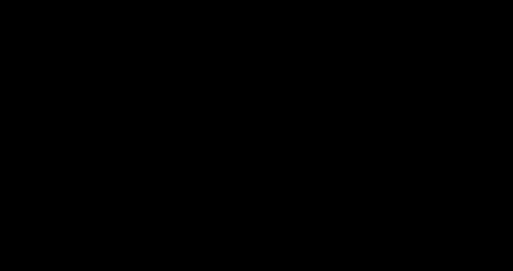

# bower-auto-link

Automatically links multiple dependent bower/npm modules in the same directory by using bower link.
Run npm-auto-link instead of bower-auto-link for installation for npm modules.

## Installation

   ```shell
   npm install bower-auto-link -g
   ```
## Usage

   Run the following command on the parent directory containing the modules.
   
   For bower modules

   ```
   bower-auto-link
   ```
   
   For npm modules
   
   ```
      npm-auto-link
   ```
   


